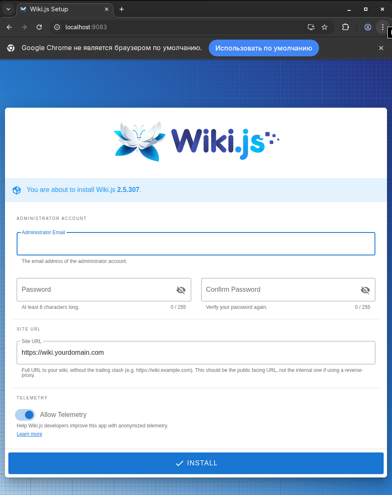

# Название выполняемого задания
Получить практические навыки в настройке инфраструктуры с помощью манифестов и конфигураций. Отточить навыки использования ansible/vagrant/docker.

# Текст задания
Варианты стенда:
nginx + node.js + (postgreSQL + wiki.js) + .Net8 (Сборка проекта)

# Описание

Порты которые использовались 9081, 9082, 9083
Все проксируется через nginx

1) Порт 9081 - В проекте исходные коды решения на .Net8, во время обработки собирается образ и разворачивается контейнер.
1) Порт 9082 - Как в методички, поднимается Node.js и под капотом так же простейший сервер.
1) Порт 9083 - Поднимается Postgres 15 + Wiki.js.

Запуск
```bash
vagrant up
```

```bash
sergey@fedora:~/Otus/homework/27$ curl http://localhost:9081
Otus forever!sergey@fedora:~/Otus/homework/27$ 
```

```bash
sergey@fedora:~/Otus/homework/27$ curl http://localhost:9082
Hello from node js serversergey@fedora:~/Otus/homework/27$
```


